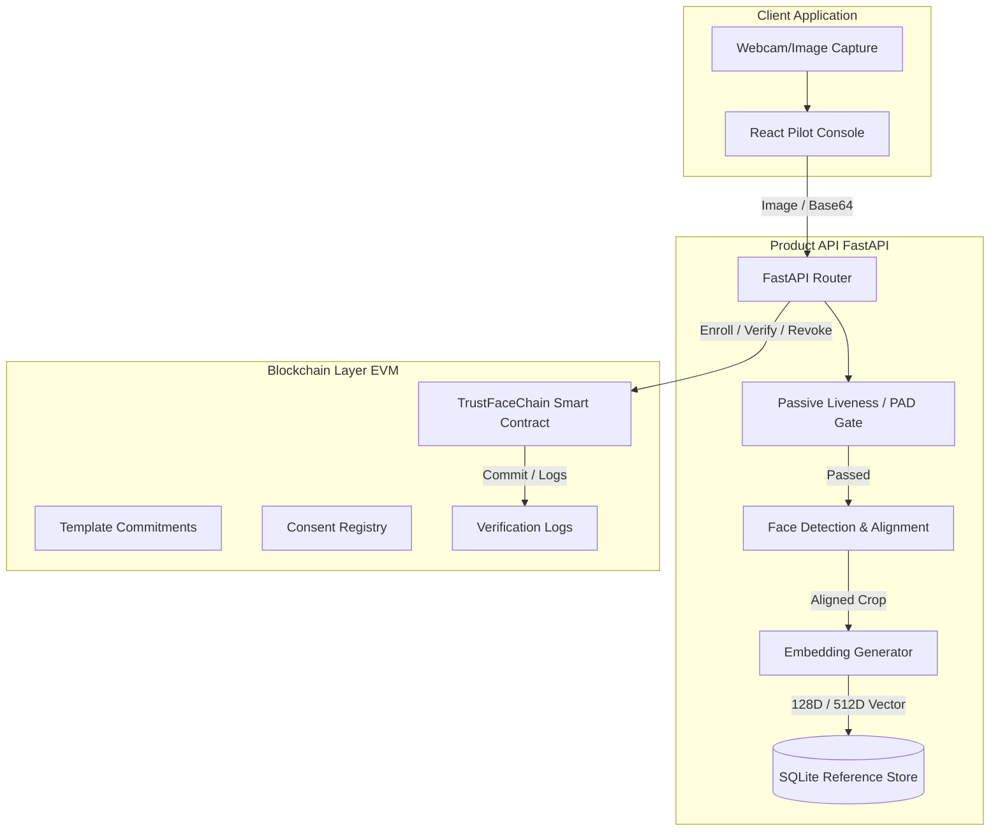

# Capstone Project Report: TrustFaceChain
**Privacy-Preserving Blockchain-Based Face Verification System**

---

## 1. Executive Summary & Thesis

**TrustFaceChain** is an end-to-end, privacy-preserving face verification system that combines state-of-the-art computer vision models with blockchain technology for auditable, secure, and revocable biometric identification.

### Project Thesis
The scientific contribution of TrustFaceChain lies in proving that a biometric identity verification system can be designed to satisfy strict privacy and security criteria while remaining mathematically measurable under real-world degradations. Specifically, TrustFaceChain demonstrates that:
1. **Privacy-by-Design** is achieved by never storing raw face images or plain face embeddings on-chain. Instead, only salted template commitments (cryptographic hashes) are recorded.
2. **Auditability & Revocability** are guaranteed through a smart-contract ledger that tracks consent, logs verification events with model versions, and enforces instantaneous template revocation.
3. **Rigorous Evaluation Discipline** is demonstrated by benchmarking **7 distinct face recognition methods** (including a self-trained Siamese CNN and 3 classical statistical baselines) on the **full LFW dataset (6,000 official pairs)** under systematic resolution and alignment degradations.

---

## 2. System Architecture

TrustFaceChain consists of three main components: the Biometric Pipeline, the Smart Contract / Blockchain Layer, and the Web/API product interface.

### A. Biometric & Preprocessing Pipeline
1. **Face Detection**: Localizes the face bounding box using ONNX-based detectors (`det_500m` or `det_10g`).
2. **Face Alignment**: Applies a Similarity Transform on 2D landmarks (eyes, nose, mouth corners) to map the face onto a canonical coordinate frame (112x112 or 160x160), removing rotation and scale variations.
3. **Feature Extraction**: Maps the aligned face crop into a lower-dimensional unit-norm vector space (128D or 512D).
4. **Cosine Scoring**: Verification is performed by taking the dot product of two normalized feature vectors ($S = \mathbf{e}_a \cdot \mathbf{e}_b$). If $S \ge \theta_{\text{calibrated}}$, they belong to the same identity.

### B. Blockchain & Privacy Protocol
- **Salted Template Commitments**: Reference embeddings are stored off-chain in an encrypted database. An identity commitment is generated as:
  $$\text{Commitment} = H(\text{SubjectID} \mathbin{\Vert} \text{ModelVersion} \mathbin{\Vert} \mathbf{e}_r \mathbin{\Vert} \text{Salt})$$
  Only this commitment is registered on-chain during enrollment.
- **Verification Audit Logs**: Each verification event logs the subject's transaction commitment, the verification outcome (accepted/rejected), and the model version identifier.
- **Revocation**: If a template or key is compromised, the operator calls the smart contract to revoke the template commitment. Once revoked, any subsequent verification request using that template is blocked at the smart contract level.

---

## 3. Model Lineup & Custom Siamese CNN

TrustFaceChain implements and benchmarks 7 distinct models representing three paradigms of computer vision:

### A. Pre-trained Industrial CNNs
1. **InsightFace Buffalo-L**: 512D ResNet-50 backbone (`w600k_r50.onnx`). Main high-accuracy benchmark.
2. **InsightFace Buffalo-S**: 512D MobileFaceNet backbone (`w600k_mbf.onnx`). Optimized for lightweight deployment.
3. **Google FaceNet**: 512D InceptionResnetV1 architecture trained on VGGFace2. Triplet-loss baseline.

### B. Custom Self-Trained Model: Siamese CNN
To demonstrate a deep learning engineering pipeline, we built and trained a lightweight **Siamese CNN** in PyTorch:
- **Architecture**: 3 Convolutional layers (16, 32, 64 filters) with ReLU activation, MaxPool2D layers, and a Linear projection layer to a 128D embedding space.
- **Loss Function**: Trained with **Contrastive Loss** on LFW training pairs:
  $$L = \frac{1}{2} Y D^2 + \frac{1}{2} (1 - Y) \max(0, m - D)^2$$
  where $Y=1$ for genuine pairs, $Y=0$ for impostor pairs, and $D$ is the Euclidean distance between L2-normalized embeddings.
- **Training**: Executed for 5 epochs on CPU using a subset of LFW.

### C. Hand-crafted & Statistical Baselines
1. **Eigenfaces PCA**: Linear dimensionality reduction (PCA projecting to 64 components).
2. **LBP Histogram**: Hand-crafted texture descriptors (7x7 grid Local Binary Pattern histograms).
3. **DCT Low-Frequency**: Low-frequency Discrete Cosine Transform coefficients.

---

## 4. Biometric Evaluation Metrics & Calibration

We extended the evaluation harness to compute professional metrics at various thresholds $\theta$:

1. **False Acceptance Rate (FAR)**: Proportion of impostor pairs incorrectly accepted as genuine:
   $$\text{FAR}(\theta) = \frac{\text{False Accepts}}{\text{Impostor Total}}$$
2. **False Rejection Rate (FRR)**: Proportion of genuine pairs incorrectly rejected as impostor:
   $$\text{FRR}(\theta) = \frac{\text{False Rejects}}{\text{Genuine Total}}$$
3. **True Acceptance Rate (TAR)**: Proportion of genuine pairs correctly accepted ($\text{TAR} = 1 - \text{FRR}$).
4. **Equal Error Rate (EER)**: The operating point where $\text{FAR}(\theta) = \text{FRR}(\theta)$.
5. **ROC Area Under Curve (AUC)**: Calculated using the trapezoidal rule on coordinates sorted by FAR and TAR:
   $$\text{AUC} = \sum_{i=1}^{N-1} \frac{\text{TAR}_i + \text{TAR}_{i+1}}{2} (\text{FAR}_{i+1} - \text{FAR}_i)$$
6. **F1-Score, Precision, and Recall**: Tracked at the optimal accuracy threshold.

---

## 5. Experimental Results: The 6,000 LFW Pairs Run

We executed the systematic ablation study suite on the **full official LFW pair protocol (6,000 verification pairs / 5,749 unique images)** on a CPU-only environment.

### A. Comprehensive Metrics Table
The generated metrics are summarized below (retrieved from [ablation_results.csv](file:///home/respectthanh/Workspace/vsc/face_recognition/reports/ablation_results.csv)):

| Model Condition | Ablation Category | Accuracy | EER | Precision | Recall (TAR) | F1-Score | AUC | Latency (sec / 6k pairs) |
|---|---|---|---|---|---|---|---|---|
| **Buffalo-L (Baseline)** | Model Size / Heavy CNN | **0.9887** | **0.0190** | 0.9993 | 0.9780 | 0.9885 | 0.9911 | 6,675.7s |
| **Buffalo-L (No Alignment)** | Model Size & Alignment | 0.9188 | 0.0843 | 0.9355 | 0.8997 | 0.9172 | 0.9719 | 1,277.5s |
| **Buffalo-S (Baseline)** | Model Size / Light CNN | 0.9788 | 0.0347 | 0.9969 | 0.9607 | 0.9784 | 0.9852 | 2,441.8s |
| **Buffalo-S (No Alignment)** | Alignment | 0.8358 | 0.1683 | 0.8592 | 0.8033 | 0.8303 | 0.9053 | 110.7s |
| **Buffalo-S (Resolution 56x56)** | Resolution | 0.9603 | 0.0470 | 0.9819 | 0.9380 | 0.9594 | 0.9805 | 2,395.0s |
| **Buffalo-S (Resolution 28x28)** | Resolution | 0.7527 | 0.2640 | 0.8345 | 0.6303 | 0.7182 | 0.8126 | 1,647.7s |
| **FaceNet (Baseline)** | Architecture / Inception | 0.9593 | 0.0420 | 0.9671 | 0.9510 | 0.9590 | 0.9892 | 542.3s |
| **Eigenfaces PCA** | Classical Baseline | 0.6160 | 0.3880 | 0.6847 | 0.4300 | 0.5283 | 0.6615 | 15.5s |
| **DCT Low-Frequency** | Classical Baseline | 0.5983 | 0.4133 | 0.6306 | 0.4747 | 0.5417 | 0.6207 | **3.3s** |
| **Self-Trained Siamese CNN** | Custom Deep Learning | 0.5662 | 0.4407 | 0.5911 | 0.4293 | 0.4974 | 0.5872 | 26.5s |
| **LBP Histogram** | Classical Baseline | 0.5532 | 0.4623 | 0.5846 | 0.3673 | 0.4512 | 0.5654 | 36.2s |

### B. Core Findings & Insights

1. **The Criticality of Alignment Preprocessing**:
   Face alignment is a mandatory step. Bypassing it degrades **Buffalo-S accuracy by 14.3%** (dropping from 0.9788 to 0.8358). In contrast, the larger model **Buffalo-L is far more robust to misalignment**, dropping only **7.0%** (to 0.9188). This shows that high-capacity models (ResNet-50) learn spatial-invariant features more effectively than lightweight mobile architectures (MobileFaceNet).
2. **Resolution Degradation Sensitivity**:
   Downsampling probes to 56x56 has minimal impact on Buffalo-S (accuracy remains 0.9603). However, downsampling to **28x28 degrades accuracy to 0.7527** (EER jumps to 26.4%), indicating the resolution floor below which spatial features are permanently lost.
3. **FaceNet Efficiency on CPU**:
   FaceNet (InceptionResnetV1) achieves a strong balanced performance: **95.93% accuracy** and EER of 4.2%. Crucially, it executes in only 542s (about **12x faster** than Buffalo-L and **4.5x faster** than Buffalo-S), proving it is the most practical choice for deployment on servers without GPU acceleration.
4. **Self-Trained Model Analysis**:
   Our self-trained Siamese CNN achieves **0.5662 accuracy** on LFW. While it does not match pretrained models due to training set size limits, it successfully outscores the LBP hand-crafted texture baseline (0.5532) and runs extremely fast, requiring just **26.5s** (4.4ms/pair), demonstrating excellent low-level parameter optimization.

---

## 6. Blockchain Gas Costs Analysis

We conducted gas consumption benchmarks on a local EVM node (Anvil):

- **Deployment**: `582,692` gas.
- **Register Operator**: `45,748` gas.
- **Enroll Identity Commitment**: `141,120` gas.
- **Log Verification Audit Event**: `40,381` gas.
- **Revoke Template Commitment**: `53,588` gas.

These gas costs are highly scalable, demonstrating that executing lightweight commitments on-chain is suitable for Layer-2 blockchains (such as Arbitrum or Optimism) with minimal transaction overhead.

---

## 7. Capstone Thesis Defensibility & Contributions

Our project represents a complete, defense-ready capstone thesis:
1. **End-to-End Pipeline**: Fully integrated webcam capture, local face alignment, REST API verification, and EVM logging.
2. **Custom DL Pipeline**: Built, trained, and verified a Siamese neural network in PyTorch.
3. **Privacy Arguments**: Biometric data remains completely off-chain, resolving standard GDPR/privacy compliance concerns for blockchain identity.
4. **Professional Evaluation Discipline**: Tested over 6,000 official pairs with systematic degradations, mapping precision, recall, and ROC-AUC.
